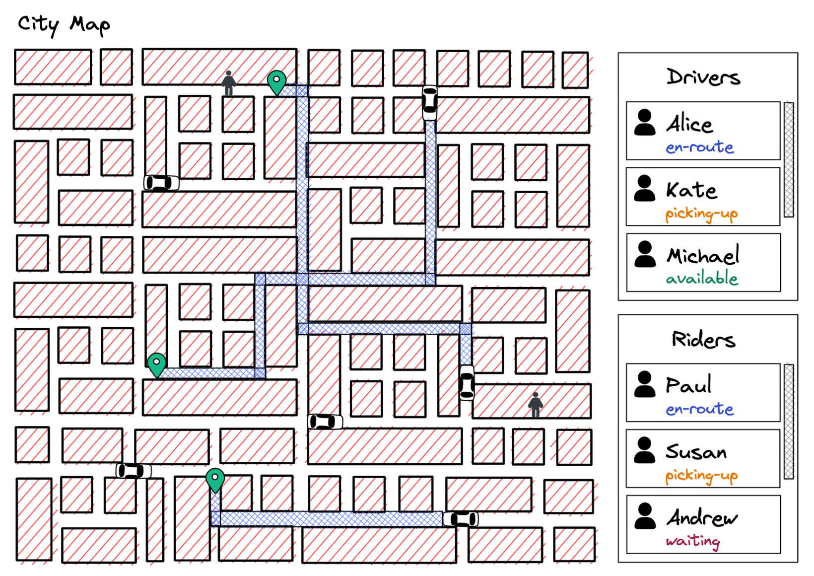
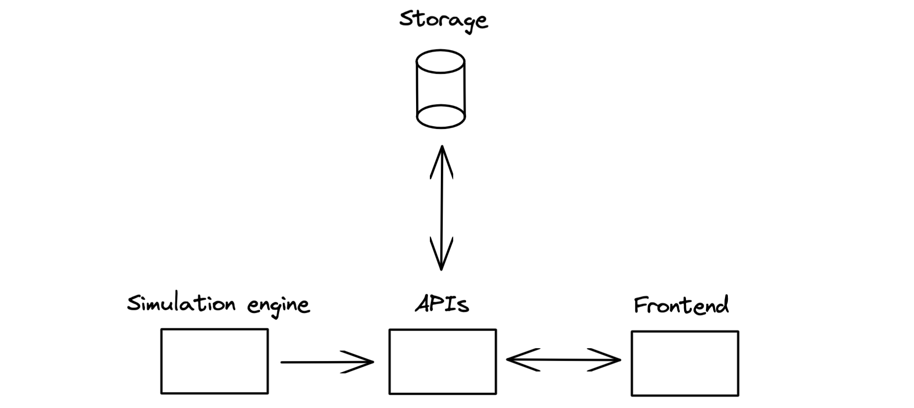
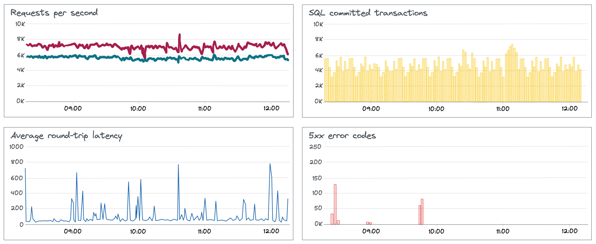

__I'm fascinated by distributed systems and I'm going to learn about them by building a clone of the Uber app.__

I've been fascinated by the Uber app for a long time. Behind it is a massive, geographically distributed infrastructure with demanding requirements on availability and latency. Thousands of microservices. Millions of requests per second. And all of this enables millions of trips every day around the world.

Of course, I'm not going to build all of *that*. But I can still create something that resembles the real thing - a system where I will implement various concepts from the domain of distributed systems. And I can learn a lot along the way.

There are several components our app will need. For a start, a single server can host all of these. We might add more machines if the complexity or the increased load requires it.

### Storage
We need to persist data on drivers, customers, rides, and locations. The database must support a high throughput of writes as every driving car continuously updates its geolocation.

### APIs
The API layer will handle all kinds of requests to our system, such as requesting rides, calculating routes, or taking payments.

### Simulation
The simulation engine is the beating heart of the app. It will simulate customers popping up, drivers accepting rides, cars updating their locations, or even unexpected delays or incidents happening.

### Frontend
We'll have a frontend app that will display the city map (see above). You'll see active routes and cars moving along them in real-time. I might also add a monitoring dashboard that will show how the system is performing, such as database loads, queue sizes, or requests per second.

My goal is to deeply understand concepts rather than just glue packages and APIs together. Therefore I'm going to build a lot of things from scratch. I'll build my own map rather than use a Google Maps API. I'll build a message queue from scratch should I need to. I don't need to rush.

This is a big project, and I'm in it for the long run. I am still determining how I'm going to do certain things. I'm aware I'm probably not even asking the right questions yet. But I'll figure it out.

Let's get started. 🚖
