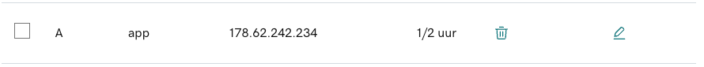
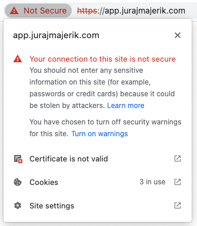
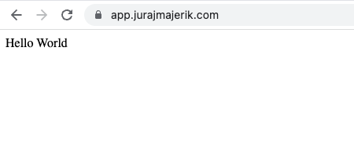

Let's set up the serving of our app's frontend. First, let's change the domain name of our server from `api.jurajmajerik.com` to a more fitting `app.jurajmajerik.com`. At this point, it's okay to serve both the frontend and the APIs from the same server. We might separate them out later.

To start, in the GoDaddy dashboard, we need to add a new [A record](https://support.dnsimple.com/articles/differences-between-a-cname-alias-url/) with the name `app` and point it to our server's IPv4 address.



We also need to generate a new SSL certificate, as any certificate pertains to a specific domain name. Because of this, if you try to access a domain at HTTPS with a non-matching certificate, you'll get a warning.



To solve this, we need to follow the steps described in the earlier [HTTPS](https://jurajmajerik.com/blog/using-https) article, substituting `api` with `app`. We can then update the `http.ListenAndServeTLS()` method with the location of the newly generated certificate and the key.

Next, let's set up a `static` folder in our `server` directory. Here we can place an `index.html` file with a simple "Hello world" message. In the future, we will serve any frontend files such as _.css_, _.js_, or any assets from this folder.

The code to serve frontend files is a simple one-liner added to the main function. At the `/` path, let's serve all of the files in the `static` folder:

```go
http.Handle("/", http.FileServer(http.Dir("./static")))
```

Let's first run `main.go` locally and check if the file is being served at `localhost:8080`. Then, let's deploy it to the production server and start the server script there.



Our app frontend is now being served at [https://app.jurajmajerik.com](https://app.jurajmajerik.com)!
