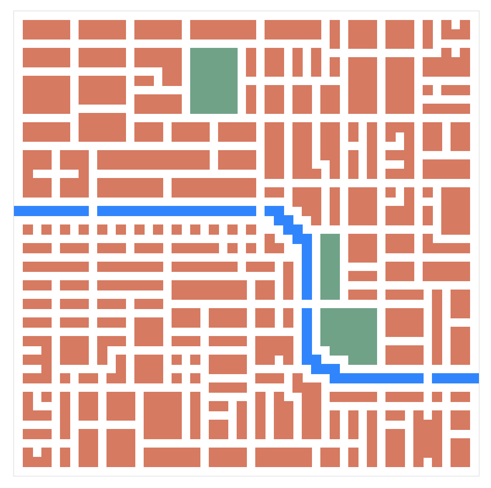

We need a map that will display all the action, such as routes requested, riders waiting and cars moving.

We can use plain JavaScript to draw the map using SVG. The map has a square shape and inside, there are 50 squares in each direction = 2500 squares in total. Points are represented by a set of coordinates starting from ```[0, 0]``` up to ```[49, 49]```.

First, we lay out all the squares inside the map and store each ```rect``` shape in an object under its corresponding coordinates.
```js
for (let x = 0; x < gridCount; x += 1) {
  for (let y = 0; y < gridCount; y += 1) {
    const rect = document.createElementNS('http://www.w3.org/2000/svg', 'rect');
    points[`${x}:${y}`] = rect;
    rect.setAttribute('width', squareSize);
    rect.setAttribute('height', squareSize);
    rect.setAttribute('x', x * squareSize);
    rect.setAttribute('y', y * squareSize);
    rect.setAttribute('fill', 'white');

    svg.appendChild(rect);
  } 
}
```

In the map, we need a way to define obstacles. These can be buildings, rivers or parks. Everything else is a driveable road.

An obstacle is defined as a rectangular shape. Four values are required to draw an obstacle: ```minX```, ```maxX```, ```minY```, ```maxY```. These lay out the ```x``` and ```y``` coordinates between which an obstacle is placed.

For example, an obstacle defined as ```[36,38,5,10]``` will be a rectangle:
- 3 points long, starting at the ```x=36``` and ending before the ```x=38```
- 6 points wide, starting at the ```y=5``` and ending before the ```y=10```

Obstacles of any size and shape can be assembled with these rectangles (e.g. L-shaped buildings, a curving river).

The following method draws the obstacles on the map.
```js
const drawObstacle = (xStart, xEnd, yStart, yEnd, color) => {
  let x = xStart;
  while (x <= xEnd) {
    let y = yStart;
    while (y <= yEnd) {
      points[`${x}:${y}`] = false;
      const rect = document.createElementNS('http://www.w3.org/2000/svg', 'rect');
      rect.setAttribute('width', squareSize);
      rect.setAttribute('height', squareSize);
      rect.setAttribute('x', x * squareSize);
      rect.setAttribute('y', y * squareSize);
      rect.setAttribute('fill', color || '#d77a61');
      rect.setAttribute('stroke', color || '#d77a61');
      
      svg.appendChild(rect);
  
      y += 1;
    }
    x += 1;
  }
};
```
An important detail - we are setting the value in the ```points``` object corresponding to an obstacle to ```false```. This will aid us when building the graph data structure that will model the road network. More on that in the upcoming post.

I initially started out by filling out the obstacle coordinates by hand, but it was quite time-consuming. Check out the ```obstacles.js``` file - there's quite a few of them! So to speed things up, I added a helper method that records coordinates upon clicking on a map square. After three clicks, this method highlights the area between the extremities and outputs the four bounding values to the console. Using this method, I was able to populate the map with obstacles quite quickly.
```js
const drawHelper = (() => {
  let count = 0;
  let minX = null, maxX = null, minY = null, maxY = null;

  const allCoords = [];

  const highlightObstacle = () => {
    let x = minX;
    while (x <= maxX) {
      let y = minY;
      while (y <= maxY) {
        const rect = points[`${x}:${y}`];
        rect.setAttribute('fill', 'gray');
        y += 1;
      }
      x += 1;
    }
  };

  return (x, y) => {
    count += 1;

    if (!minX || x < minX) minX = x;
    if (!maxX || x > maxX) maxX = x;
    if (!minY || y < minY) minY = y;
    if (!maxY || y > maxY) maxY = y;

    highlightObstacle();

    if (count === 3) {
      count = 0;
      allCoords.push([minX, maxX, minY, maxY]);
      minX = null, maxX = null, minY = null, maxY = null;
      console.log(JSON.stringify(allCoords));
    }
  };
})();
```

`youtube: https://www.youtube.com/watch?v=i85P5N5I7mE`

This is the final result. I know, it's not a high fidelity map, but it will suffice for now. Eventually, we might use an actual city map, such as one from OpenStreetMap.


