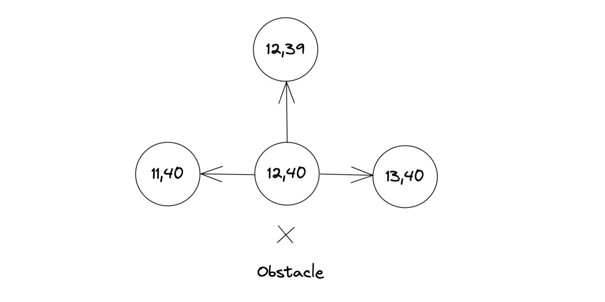

We need a data structure allowing us to _move_ from point A to point B. This data structure is called a _graph_.

Suppose we have a point on the road at coordinates ```12, 40```. Let's call this point a node. From this node, we want to be able to move to the adjacent road nodes. So every node in our data structure must include pointers to its neighbors.



When we drew our map in the previous post, we populated the ```points``` object, which had a key for every coordinate on the map. If a coordinate was a piece of road, we stored the corresponding ```rect``` element to it. If it was an obstacle, we set its value to ```false```.

We can now build our graph using the ```points``` object. We start at the node ```0,0```. At every node, we explore all four adjacent coordinates. If we find a road node at that coordinate (by checking if the coordinate is truthy in ```points```), we initialize that node as an empty object (if it doesn't exist yet), and we call the ```build``` function on that node. This way, our function recursively visits all road coordinates and populates the graph.

```js
const build = async ({ x, y }) => {
  visited[`${x}:${y}`] = true;
  const currentNode = nodes[`${x}:${y}`];

  await highlightVisited(`${x}:${y}`);

  const neighbours = [
    [x, y - 1],
    [x + 1, y],
    [x, y + 1],
    [x - 1, y],
  ];

  for (const [x, y] of neighbours) {
    const coords = `${x}:${y}`;
    if (points[coords]) {
      nodes[coords] = nodes[coords] || {};
      currentNode[coords] = nodes[coords];
      if (!visited[coords]) await build({ x, y });
    }
  }
};
await build({ x: 0, y: 0 });
```

The video shows how the build algorithm traverses the points in the network. I've added some delay to animate this (hence the ```async/await``` in the code). At every node, I log the node object to the console.
`youtube: https://www.youtube.com/watch?v=us8GmDnwwn8`

The final product is the ```nodes``` object. It stores every node in our road network. If we now pick any coordinate on the map, we can explore its neighbors and get to any other point in the network.
