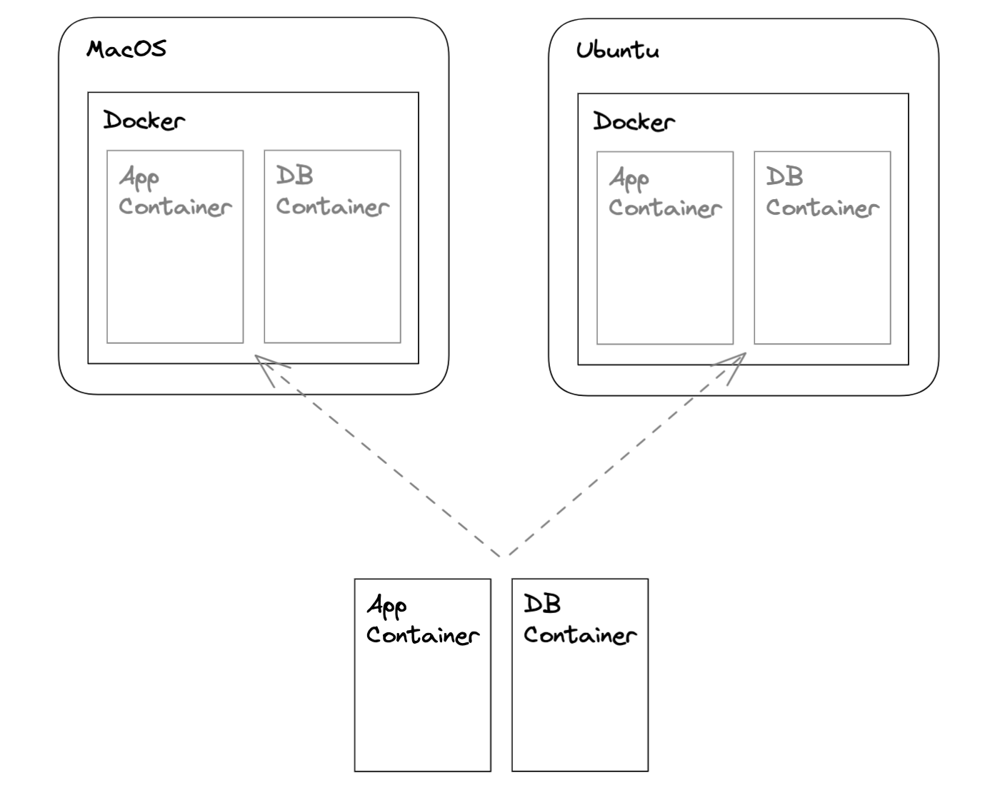

Today I was going to install an SQL database. It occurred to me that I would have to *again* do this separately for my local MacOS machine and the Ubuntu production server. This workflow is not ideal. Over time, we will introduce many more components to our app. Setting them up manually across different machines and environments would quickly prove unmanageable.

It's time to introduce Docker. We will use Docker to package our application into containers. A container is an isolated environment that includes all code, libraries, and dependencies it needs to run. This container can then be deployed on any machine that has Docker installed, and will always run in the same environment, regardless of the underlying operating system or hardware.



Today we'll start by containerizing the web server itself. The first step is to [install Docker Desktop](https://www.docker.com/products/docker-desktop/) on the local MacOS. Docker Desktop is a full installation of Docker that also includes a nice GUI for inspecting and working with containers.

A Docker container runs from an *image*. When we launch a container, we are creating a new runtime environment based on the instructions specified within the image.

An image is specified via a Dockerfile. This file contains all necessary instructions for building the image, including the underlying operating system, programming language, required dependencies, and commands needed to start the application. Here's what our *Dockerfile* looks like:

```
FROM golang:1.18-alpine

WORKDIR /app

COPY go.mod ./
COPY *.go ./
COPY static ./static

RUN go build -o /app

CMD [ "/app" ]
```

Here are the step-by-step instructions for building our image, as specified in our ```Dockerfile```:
- Download and install *Alpine*, a lightweight distribution of Linux. This base image already includes an installation of ```Go 1.18```.
- Set the working directory of the app. Note that here we are referring to the private filesystem inside the container. From now on, we can refer to our ```/app``` folder with the ```.``` directive.
- Copy the files from ```/app``` to the container's root directory. This includes all ```.go``` files, ```go.mod``` and the static files served for our frontend app.
- Build the binary.
- Run the binary to start our web server.

We can now run the Docker ```build``` command to build our image. The first build takes a bit longer since Docker needs to download the base image. Subsequent builds are much faster.
```
docker build --tag app .
```

The ```.``` directive here refers to what Docker terms *context* - a set of files that Docker has access to while building the image. This includes the *Dockerfile* with instructions and any app files that need to be copied into the container.

Once we've built a Docker image, we can run it as a container. Here we include the following flags:
- ```-d``` runs the container in the detached mode, so the app will keep running even when the terminal is disconnected.
- ```--expose``` exposes port ```8080``` of the container.
- ```-p``` binds an exposed container's port to the host machine's port. If we didn't do this, our app would not be accessible at ```localhost:8080```. That's the level of isolation Docker provides by default.
- ```-e``` passes the environment variable required by our web server.

```
docker run \
-d \
--name app \
--expose 8080 \
-p 8080:8080 \
-e SERVER_ENV=DEV \
app
```

We can now go to the browser and see if the app is being served at [http://localhost:8080](http://localhost:8080).

We can preview existing containers with the following command:
```
docker image ls
```

Finally, we can stop and remove a container like so:
```
sudo docker stop app
sudo docker rm app
```

In the next post, we will deploy a Docker container to our production server.
