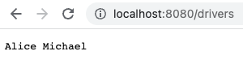

Let's connect our server to the database. First, let's add the `postgres` folder where we will keep our database-related code. We also need to include this folder in the `Dockerfile`:
```
COPY postgres ./postgres
```

Inside the `postgres` folder, let's create the `db.go` file which will initialize the connection and store it in the `Connection` variable. We will hardcode the configuration parameters for now, as we want to keep moving.

```go
var Connection *sql.DB

func InitDB() {
  connStr := fmt.Sprintf(
    "user=%s password=%s host=%s port=%d dbname=%s sslmode=disable",
    "postgres", "mysecretpassword", "localhost", 5432, "postgres",
  )

  var err error
  Connection, err = sql.Open("postgres", connStr)
  if err != nil {
    fmt.Println(err)
  }
}
```

We can now import the package in `main.go`:
```go
import (
  db "app/postgres"
  ...
)
```
The `db` is the local name we are giving to this import. The `app/postgres` is the path of the package. Note that all files in a single folder must have the same package name. Here we are importing the entire `db` package and calling it `db` locally. But we could also give it a different name. This is helpful when two or more packages share the same name.

Now that we've imported the `db` package, we can initialize the database in `main.go`:
```go
db.InitDB()
```

We now have the database connection available at the `db.Connection` variable. Let's test it by adding a `getDrivers()` handler function. This function queries the `name` column from the `drivers` table and sends it to the client as a response.
```go
func getDrivers(w http.ResponseWriter, req *http.Request) {
  rows, err := db.Connection.Query("SELECT name FROM drivers")

  // ...
  // See the full code in the Github repo
  // ...

  fmt.Fprintf(w, data)
}
```

Finally, let's register `getDrivers()` as a handler function for the `/drivers` URL path.
```go
http.HandleFunc("/drivers", getDrivers)
```

Now start the server with `go run main.go` and head to the browser. The data from our database is now being served at [http://localhost:8080/drivers](http://localhost:8080/drivers).

