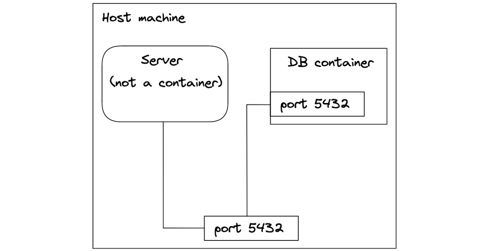

There's an issue with our implementation from the last post. Have you spotted it?

We are running our server code outside a container with `go run main.go`. The server connects to the database container via port `5432` on the host machine. This works because the database container maps its port to the port on the host machine.



Of course, we want to run our server in the container we've already provisioned. But if we run it as a container, how does the web server container connect to the database container?


The answer is they connect via a *network*. Any two containers that share the same network can connect to each other. Docker offers commands to set up a network and then connect individual containers to it. But there's a better way to do this. It's time to introduce Docker Compose.

Docker Compose allows us to spin up multi-container applications easily. As the number of containers in our application grows, it's becoming impractical to start containers individually. With Docker Compose, we can define our stack within a single `docker-compose.yml` file and start everything with a single command. We can also define the network these containers will share within the file. This will allow us to connect our two containers.

Our `docker-compose.yml` file is structured as follows:
```yml
services:
  app:
    image: app
    ports:
      - 8080:8080
    environment:
      SERVER_ENV: DEV
  db:
    image: postgres:15.1-alpine
    ports:
      - 5432:5432
    volumes:
      - app-db:/var/lib/postgresql/data
    environment:
      POSTGRES_PASSWORD: mysecretpassword

volumes:
  app-db:
    external: true
```
The structure is self-explanatory; we've copied most of the information from the `docker run` commands we previously used to start our containers. Two things worth mentioning:
- Docker Compose creates a network automatically. The `services` will become the network aliases at which containers can access each other.
- The `volumes` need to be explicitly defined at the top level. Because we are using a volume previously defined by Docker (and not Docker Compose), we need to add the `external: true` option. Otherwise, Docker Compose creates its own volume, which it prefixes with the project name `app`. In that case, we would be accessing a new empty volume instead of the original volume with our data.

To connect our server container to the database container, all we need to do is change the `hostname` parameter from `localhost` to `db` in `db.go`:
```go
func InitDB() {
  connStr := fmt.Sprintf(
    "user=%s password=%s host=%s port=%d dbname=%s sslmode=disable",
    "postgres", "mysecretpassword", "db", 5432, "postgres",
  )
  // ...
}
```
Now rebuild the image and start the app with Docker Compose:
```bash
docker compose up -d
```

Head to the browser and verify that we get our data back from [http://localhost:8080/drivers](http://localhost:8080/drivers). Our two containers are now connected!
