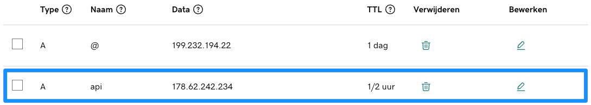

Let's connect a domain to our server. This will save us from having to type the IP address when logging in and calling our server's APIs in the future.

I already own the domain **jurajmajerik.com**. I'm just going to add the `api.` prefix before it and assign it to the server IP.

My domain is managed by GoDaddy. In their interface, I added a new [A record](https://support.dnsimple.com/articles/differences-between-a-cname-alias-url/) with the name `api` and pointed it to my server's IPv4 address.



By doing this, we are updating the [Domain Name System (DNS)](https://aws.amazon.com/route53/what-is-dns/#:~:text=DNS%2C%20or%20the%20Domain%20Name,2.44) with a new mapping (domain -> IP address). The changes take a few hours to propagate to all DNS servers. Once that happens, I can log in to my server like so:

```
➜  ~ ssh root@api.jurajmajerik.com
root@api.jurajmajerik.com's password:
Welcome to Ubuntu 20.04.3 LTS (GNU/Linux 5.4.0-110-generic x86_64)
...
```
