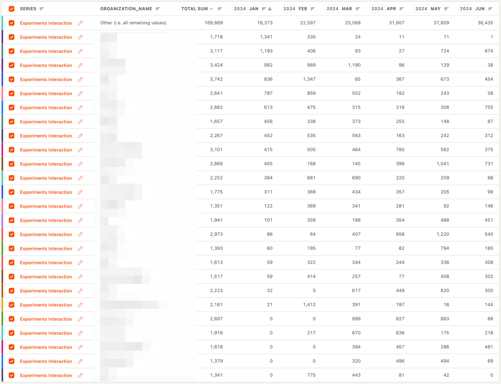
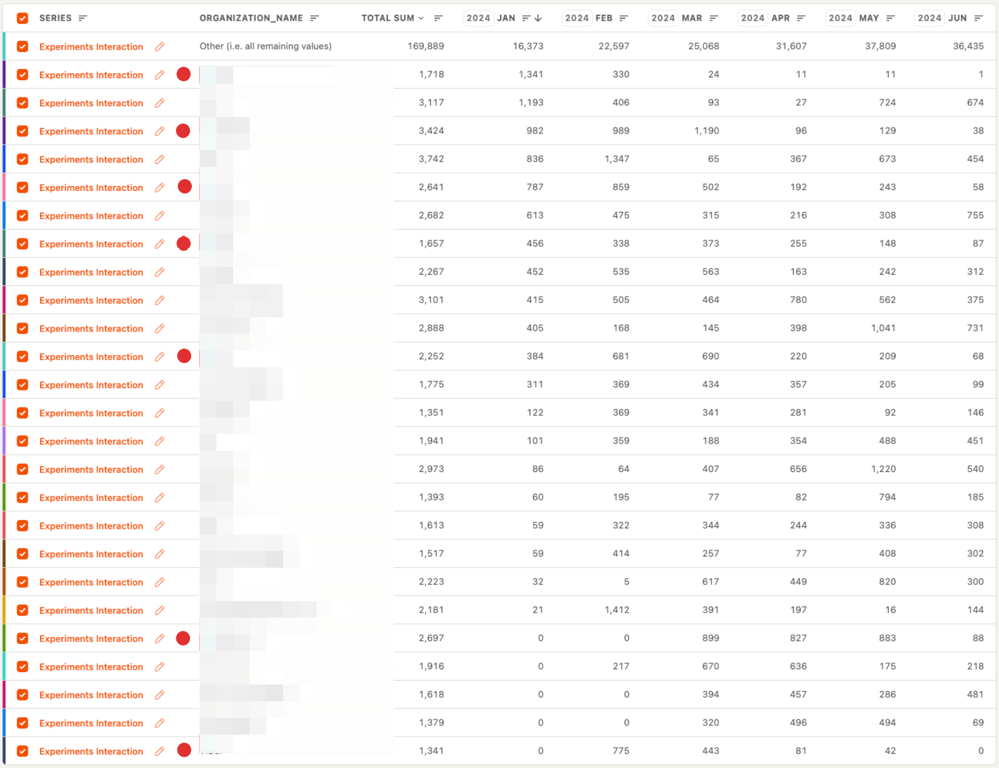

We use PostHog to understand our users better.

To track activity, we have an action called `experiment interaction`, which includes events like `experiment viewed` and `experiment launched`.

We then have an insight, where we count the number of these interactions per unique organization and then breaking it down by organization name. The table below shows the top 25 users of experiments in January.

This allows us to identify users who might be churning. It appears that 7 organizations are either churning or at high risk. I'm going to follow up with them to understand why.

