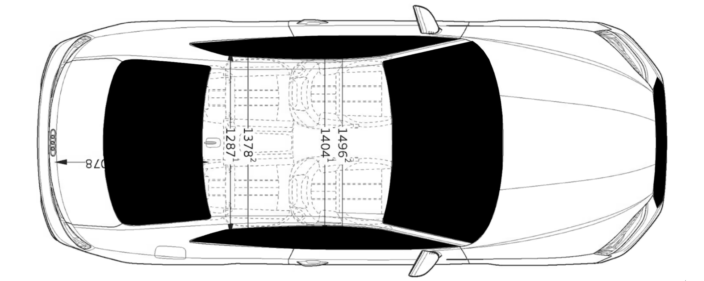
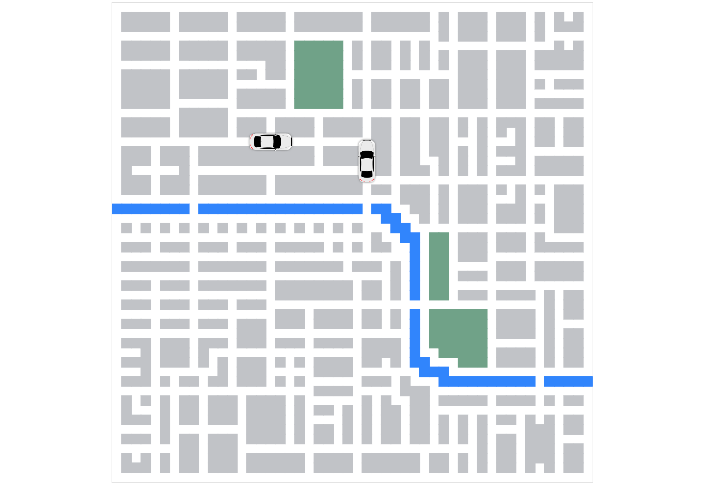

Let's design a car icon we will place on the map. I used the amazing and free [Vectr](https://vectr.com/) editor. First, I googled a technical drawing of the Audi A5 and placed it on the canvas. Then I used it as an aid when drawing the car components with the pen tool. I used the mirroring feature to copy and mirror some elements (such as the side windows) to preserve symmetry. I then exported the final SVG.



Let's now come back to our frontend code. The SVG from Vectr is not ready to use, as it's in a raw HTML format. We could convert everything to JSX by rewriting attribute names to the required camel case (for example, `stroke-width` would become `strokeWidth`), but that would be pretty tiresome. For now, let's do the following. Remove the first two tags from the SVG (`<svg>` and `<g>`). Create a new file called `CarIcon.js` and store the string in the `shapes` variable. We'll come back to our SVG in a second.
```js
const shapes = `
<defs>
<filter id="shadow">
  <feDropShadow dx="0" dy="0" stdDeviation="2" flood-color="#696969"/>
</filter>
</defs>
<g transform="matrix(1 0 0 1 50 49.98)" id="r8Pgl5yt7qRzOV9wY8vIq"  >
// ...
```

Next, let's add our `Car` component. The component will manage the car's movement on the map, so it needs to have its own state which it will keep recalculating. For now, we need the `position` on the map and the `rotation` (the direction) of the car.
```jsx
class Car extends React.Component {
  constructor(props) {
    super(props);
    this.state = {
      position: props.next,
      rotation: props.rotation,
    };
  }

  render() {
    const { position, rotation } = this.state;
    const [x, y] = position;
    return (
      <CarIcon
        x={x * squareSize - 20}
        y={y * squareSize - 20}
        rotation={rotation}
      />
    );
  }
}
```
Next, let's update our `Map` component. This component will periodically fetch the state of the rides from the API, and pass it down to the individual cars. For now, let's place two static cars on the map with the `placeCars()` method.
```jsx
class Map extends React.Component {
  constructor(props) {
    super(props);
    this.state = {
      cars: [],
    };
  }

  async placeCars() {
    this.setState(() => ({
      cars: [
        {
          id: 'car1',
          next: [16,14],
          rotation: 0,
        },
        {
          id: 'car2',
          next: [26,16],
          rotation: 270,
        }
      ]
    }));
  }

  componentDidMount() {
    this.placeCars();
  }

  render() {
    // ...

    const cars = this.state.cars.map(({ id, next, rotation }) => {
      return <Car key={id} next={next} rotation={rotation} />;
    });

    return (
      <svg
      width={gridSize}
      height={gridSize}
      className="map"
      >
        {obstacleElems}
        {cars}
      </svg>
    );
  }
}
```

Now, let's return to `CarIcon.js`. We need to create a wrapper around our SVG shapes to which we pass the coordinates and the `rotation` parameter. Then we can set the string with our SVG shapes to the inner HTML of the `g` component using the `dangerouslySetInnerHTML` attribute (not dangerous in this case).
```jsx
const CarIcon = ({ x, y, rotation }) => (
  <svg x={x} y={y} width="50" height="50" viewBox="0 0 100 100" border="solid 10px black">
    <g width="50" height="50" transform={`rotate(${rotation})`} transform-origin="50px 50px" dangerouslySetInnerHTML={{ __html: shapes }} />
  </svg>
);
```

Now let's have a look at our map. Looking good!
