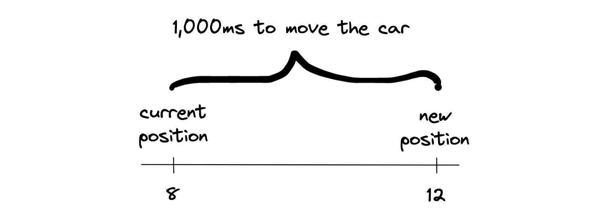
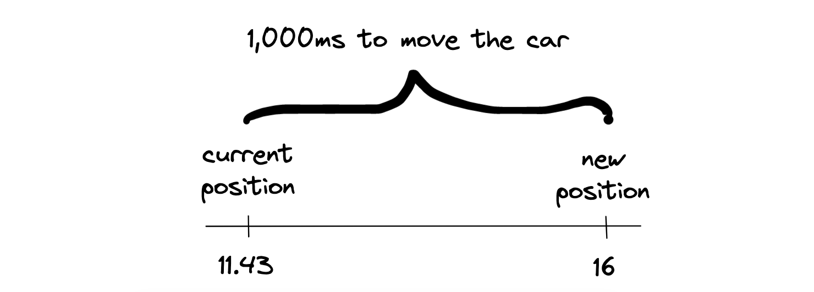

A car is going to be moving along a calculated path between the starting point and the destination. An example path looks like this:
```js
const path = [
  [8, 17],
  [8, 16],
  [8, 15],
  // ...
  [16, 14],
  [16, 13]
];
```

Initially, the frontend will receive the starting position of the car. Then it's going to periodically poll the API for updates. With every response, it will receive an updated location of the car in a format similar to this one.
```js
// 12:32:10
  {
    id: 'car1',
    next: [8,17]
  }

// 12:32:12
  {
    id: 'car1',
    next: [7,14]
  }

// 12:32:14
  {
    id: 'car1',
    next: [6,7]
  }
```

With every received update, the frontend will animate the movement of the car between its current location on the map and the new updated location.

Let's draw this out. For the sake of simplicity, let's show this on a single axis. Let's assume we are polling for an update every second - that's 1000 miliseconds. If we are to display the animation for the entirety of the time until the next update, we need to traverse four points on the map (8 -> 12) in exactly 1,000 miliseconds.



How many steps we are going to animate in the 1,000 miliseconds? Thirty frames per second should give us a smooth visual. So 1,000 ms / 30 frames = 1 update every ~33 miliseconds.

*You might've noticed a catch. 1,000 miliseconds is the time between requests are made. Of course, it takes additional time for the response to get back. At this point, we don't need to worry about it. We're going to mock the location updates in the frontend, which will give us a new location exactly every 1,000 miliseconds. Once we incorporate a real API call, we will account for the extra response time.*

Now that we know how many updates we want to perform within our update window, we can calculate the update increment. The distance between 8 and 12 is 4 pixels. Dividing the distance of 4 with our number of updates (30) gives us 0.1333. That means, every ~33 miliseconds, we are going to move the car on the map by 0.1333 pixels.

The set of coordinates between the current location on the map and the up-to-date location of the car is called a *section*. In our example, the section we wanto to traverse has the following points: ```[9, 10, 11, 12]```.

Here's one important detail to consider. Suppose we receive a location update and start moving the car on the map towards point `12`. When we are at `11.43`, we already receive an update with a new location. This guaranteed to happen once we start polling an actual API. What should we do then?

In that case, we should stop our current animation and kick off a new animation round. The new animation will calculate a new section to traverse. The start of this new section will be the current location on the map. That is, the furthest point we got to during our latest animation.



For the sake of completeness, what happens if we complete the animation and we still haven't received a new location update? No big deal - the car will just stop moving and wait for the new set of coordinates.

Now let's dive into to the implementation. The utility methods for implementing the animation are grouped in `movement.js`. First, we need a method to find the next coordinate on the path from our current point.

```js
export const getNextCoordIndex = (currX, currY, path) => {
  return path.findIndex(([x, y], i, path) => {
    if (currX === path[i][0] && currY === path[i][1]) return true;
    if (i === 0) return false;

    const xMatches = x === currX;
    const yMatches = y === currY;

    return (
      (xMatches && isBetween(currY, path[i][1], path[i - 1][1]))
      ||
      (yMatches && isBetween(currX, path[i][0], path[i - 1][0]))
    );
  });
}
```

Next, we need a method for incrementing the current coordinate to bring it closer to the next point. Note that we never allow the current point to exceed the next point. This can happen if we still haven't received an update by the time we reach the end of the current animated section.
```js
export const advanceCoord = (curr, next, increment) => {
  if (next > curr) {
    curr = curr + increment;
    if (curr + increment > next) curr = next;
  } else {
    curr = curr - increment;
    if (curr - increment < next) curr = next;
  }

  return curr;
};
```
I've added unit tests for these methods in `movement.test.js`. The `create-react-app` already comes with the Jest testing library fully set up. When you run `npm run test`, all files ending with `*.test.js* are being ran in a `watch` mode. Whenever you save your changes, the tests are re-run, giving us a nice iteration cycle.

Finally, let's put everything together in the `move()` method of the `Car` class. When we receive a next point, we will calculate the upcoming section, the increment, start updating the coordinates. After calculating a new update, we set new state of the `Car`, trigerring a re-render of the visual. We wait for the duration of the `refreshInterval` between recalculating again.
```js
  async move(next) {
    const { path, position } = this.state;
    let [currX, currY] = position;
  
    const startIndex = getNextCoordIndex(currX, currY, path);
    const endIndex = path.findIndex(([x, y]) => {
      return x === next[0] && y === next[1];
    });
    const section = path.slice(startIndex, endIndex + 1);

    const distance = endIndex - startIndex + Math.max(currX % 1, currY % 1);
    const steps = fetchInterval / refreshInterval;
    const increment = distance / steps;
  
    for (let i = 0; i < section.length; i++) {

      const [nextX, nextY] = section[i];

      while (currX !== nextX) {
        if (next !== this.props.next) return;

        currX = advanceCoord(currX, nextX, increment);
        this.setState((state) => ({ // eslint-disable-line
          position: [currX, state.position[1]],
          path: state.path,
        }));
        await wait(refreshInterval);
      }

      while (currY !== nextY) {
        if (next !== this.props.next) return;

        currY = advanceCoord(currY, nextY, increment);
        this.setState((state) => ({ // eslint-disable-line
          position: [state.position[0], currY],
          path: state.path,
        }));
        await wait(refreshInterval);
      }
    }
  }
```
Remember that whenever the `next` parameter changes (stored in `this.props`), we want to stop the current animation and let the next animation take over. That's why we are constantly checking the value of this parameter in every update cycle:
```js
if (next !== this.props.next) return;
```

Finally, let's add some mock some API data. We just need a path on the map and a couple of update points. Here's the structure:
```js
const path = [
  [8, 17],
  [8, 16],
  // ...
  [16, 14],
  [16, 13]
];

const records = [
  {
    id: 'car1',
    next: [8,17],
    path,
  },
  // ...
  {
    id: 'car1',
    next: [16,13],
    path,
  },
];
```

Then we can kick off our updates in our `Map` component, spaced 1 second in between:
```js
  async simulate() {
    for (const record of records) {
      this.setState(state => ({
        cars: [record]
      }));
      await wait(fetchInterval);
    }
  }

  componentDidMount() {
    this.simulate();
  }
```

And here's our car dashing across the map. It looks pretty funny not making any turns. We'll address that in the next post!
`youtube: https://www.youtube.com/watch?v=Cx8m8qiz_a4`
