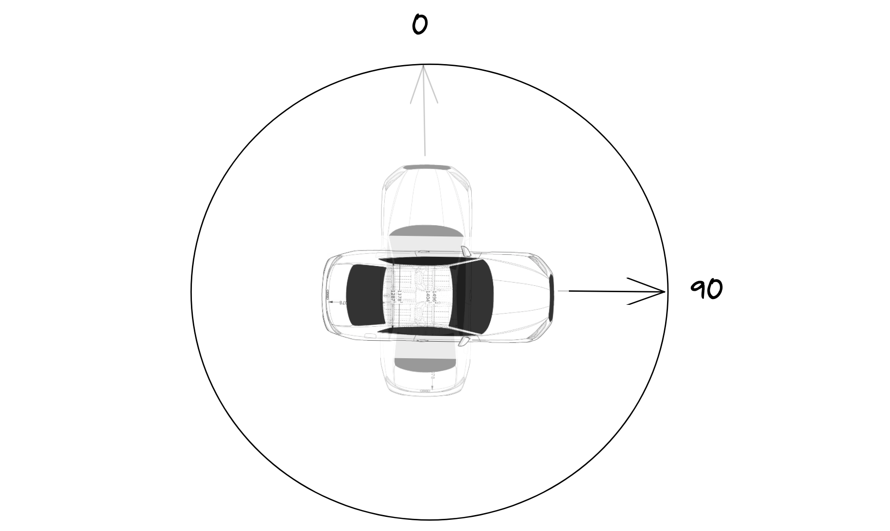

The only thing our car animation needs are turns. Let's finish it up.

A brief housekeeping first. Because our UI is growing, I've split out the `Map` and the `Car` components into separate files. I've also added the `config.js` file that holds all the configuration constants. Some of them are shared by both components, so it's handy to keep them in a single location.

Now onto rotation. We always need two points to calculate the rotation of the car - the current and the previous coordinate. Suppose the initial car position is `[7,20]`. If the next location is `[8, 20]`, we know the car is advancing on the x-axis towards _east_. Therefore, its azimuth is 90 degrees. Setting the `transform: rotate(x)` property of the car to 90 degrees will get us the desired rotation. Same as in case of moving the car, we will be setting the rotation in small steps, achieving smooth animation.



Before we tackle rotating the car, we need to calculate the number of turns a car will make within a section. Recall that a _section_ is part of the path a car traverses during a single animation cycle. A section starts at the car's current position on the map and ends at the latest updated location from the server.

We have limited time to traverse the section (roughly the time until the next update). If we make turns while traversing a section, we need to allocate some time for them and thus subtract this time from the total time available for the traversal.

The `countTurns()` method calculates the number of turns within a section of the path. It uses the helper method `getDirection()`, which determines the axis the car travels on. Whenever the axis of travel changes, we count it as a turn.

```js
export const getDirection = (section, i) => {
  const x0 = section[i - 1][0];
  const x1 = section[i][0];
  return x1 !== x0 ? "x" : "y";
};

export const countTurns = (section) => {
  let count = 0;
  let currDirection = getDirection(section, 1);

  for (let i = 2; i < section.length; i++) {
    let newDirection = getDirection(section, i);
    if (newDirection !== currDirection) {
      currDirection = newDirection;
      count++;
    }
  }

  return count;
};
```

Next, we need a method for calculating the target rotation. Based on the current and the previous coordinate, the final rotation will be one of `0, 90, 180, 270`.

```js
export const getRotation = (path, i) => {
  const [x0, y0] = path[i - 1];
  const [x1, y1] = path[i];
  const direction = x1 !== x0 ? "x" : "y";

  if (direction === "x" && x1 > x0) return 90;
  else if (direction === "x" && x0 > x1) return 270;
  else if (direction === "y" && y1 > y0) return 180;
  else return 0;
};
```

The next question is - in which direction do we turn the car? We can get to our final target azimuth by turning left or right. So we need to calculate the distances for both options and then choose the shorter one:

```js
export const getTurnDistance = (curr, target) => ({
  distClockwise:
    target > curr && target <= 360 ? target - curr : 360 - curr + target,
  distCounterclockwise:
    target >= 0 && target < curr ? curr - target : curr + 360 - target,
});
```

_Again, the above methods are tested in_ `movement.test.js`. _Take a look at the test cases to better understand inputs and outputs._

Now let's put everything together. First, let's adjust the `move()` method of `Car`. We need to count the number of turns within a section, calculate the duration of the turns and subtract this from the time available for the section traversal.

```js
const turnCount = countTurns(section);
const turnsDuration = turnCount * turnDuration;
// ...
const steps = (fetchInterval - turnsDuration) / refreshInterval;
```

Next, let's add the `rotateBusy` property to the constructor of car. It's possible that halfway through a rotation, we will receive a new coordinate and start moving towards it. We can't do it before we complete the current rotation. This field will keep track of it.

```js
constructor(props) {
  // ...
  this.rotateBusy = false;
  // ...
}
```

Whenever a car arrives at a new coordinate within a section, we can rotate it. We only do this from the index `1` of a section onwards (remember that we need two points to determine the rotation). If there is a rotation currently underway, we wait for it to complete before beginning a new one.

```js
// ...
for (let i = 0; i < section.length; i++) {
  if (i > 0) {
    while (this.rotateBusy) {
      await wait(refreshInterval);
    }
    await this.rotate(section, i);
  }
  // ...
}
// ...
```

Finally, let's add the `rotate()` method. We determine the direction of the turn and start incrementing or decrementing the degrees of rotation. We keep doing this until we reach the desired rotation.

```js
async rotate(section, i) {
  this.rotateBusy = true;

  let rotation = this.state.rotation;
  const targetRotation = getRotation(section, i);
  if (this.state.rotation === targetRotation) return this.rotateBusy = false;

  const { distClockwise, distCounterclockwise } = getTurnDistance(rotation, targetRotation);
  const isClockwise = distClockwise < distCounterclockwise;

  const diff = Math.min(distClockwise, distCounterclockwise);
  const steps = turnDuration / refreshInterval;
  const increment = diff / steps;

  while (this.state.rotation !== targetRotation) {
    if (isClockwise) rotation += increment;
    else rotation -= increment;

    if (rotation > 360) rotation = 0;
    else if (rotation < 0) rotation = 360 - Math.abs(rotation);

    this.setState({ rotation });
    await wait(refreshInterval);
  }

  this.rotateBusy = false;
}
```

Now let's have a look at the fruits of our work!
`youtube: https://www.youtube.com/watch?v=8yF3ALgKsCw`
