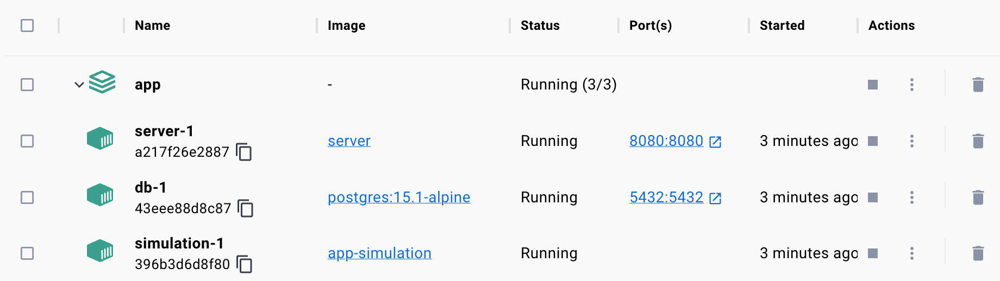

We have iterated a fair bit on our project and a general structure is emerging. We have two containers now (web server and database), and we are about to add a third one for the simulation code. Let's put everything in separate folders and see how we can improve our build process.

First, let's rename the `app/postgres` to `app/db`. It's better if the name describes the *function* of the component rather than the name of the technology used. This is also consistent with the rest of the top-level folders. Then we just need to update the import statement in `server/main.go`:
```go
import (
  db "app/db"
  // ...
)
```

Next, let's put all server-related code to the `server` folder. The only adjustment needed is the path to the frontend bundle:
```go
http.Handle("/", http.FileServer(http.Dir("../frontend/build")))
```

The `server` folder will have its own Dockerfile for the image for the web server container. This is exactly what our only Dockerfile has been doing so far. Apart from renaming `postgres` to `db`, the only adjustment we need to make now is the `CMD` directive at the bottom. Before we execute the binary, we need to `cd` into the server folder.
```dockerfile
FROM golang:1.18-alpine

WORKDIR /app

COPY go.mod ./
COPY go.sum ./

COPY server ./server
COPY db ./db
COPY frontend ./frontend

RUN cd server && go build -o main

EXPOSE 8080

CMD cd server && ./main
```

Now, let's add the `simulation` folder. This will include the simulation code that will generate riders, match them with drivers, and continually update the database. The code will be written in Javascript, running in Node.js. So let's run `npm init` to set up the `package.json` file as is required for a Node.js project.

Then let's add the `main.js` file. For now, we can add an infinite loop outputting some data. This will help us double-check if the container is running correctly.
```js
const main = async () => {
  while(true) {
    console.log(`Hello ${Math.floor(Math.random() * 100)}`);
    await wait(200);
  }
};
main();
```
We now need a Dockerfile containing the instructions for building our `simulation` container. We will use the Node.js v19 base image, copy the simulation source code and then start the script with the Node.js runtime.
```docker
FROM node:19-alpine

WORKDIR /app

COPY simulation ./simulation

CMD cd simulation && node main.js
```

After all of the adjustments, this is how the project structure looks like:
```
|____go.mod
|____go.sum
|____deploy.sh
|____docker-compose.yml
|____prod_deploy.sh

|____db
| |____db.go

|____frontend
| |____node_modules
| |____public
| |____package-lock.json
| |____package.json
| |____build
| |____src

|____simulation
| |____Dockerfile
| |____main.js
| |____package.json

|____server
| |____Dockerfile
| |____main.go
```

Now comes the fun part. Previously, we've been building every container individually using the `docker build` command. Let's make our life simpler with the `BUILD` directive in the `docker-compose.yml` file.
```dockerfile
services:
  server:
    image: server
    build:
      context: .
      dockerfile: ./server/Dockerfile
    ports:
      - ${SERVER_PORT}:${SERVER_PORT}
    volumes:
      - /etc/letsencrypt:/etc/letsencrypt
    environment:
      SERVER_ENV: ${SERVER_ENV}
  simulation:
    build:
      context: .
      dockerfile: ./simulation/Dockerfile
  db:
    image: postgres:15.1-alpine
    ports:
      - 5432:5432
    volumes:
      - app-db:/var/lib/postgresql/data
    environment:
      POSTGRES_PASSWORD: ${POSTGRES_PASSWORD}

volumes:
  app-db:
    external: true
```
As you can see, for any container for which we need to build an image from a Dockerfile, we pass the reference to the Dockerfile. We also specify the context, which is the path to the top level of our project folder. A Dockerfile will access the required files at this path.

*Notice the `db` folder doesn't have its own Dockerfile. This folder only includes the code for connecting to the database. The database itself is instantiated simply from the base Postgres image.*

Now we can build all of our images at once with:
```bash
docker-compose build
```

And then start everything with:
```bash
docker-compose up -d
```

Our entire stack is now running.

