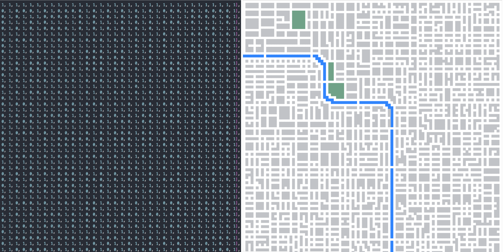

Previously, we added functionality for generating customer locations. This was straightforward - pick a random node from the available road nodes. But what about generating destinations?

Before we start, let's revisit our graph data structure. [Previously](https://jurajmajerik.com/blog/build-graph/), we've built our graph as an object of objects, where each node would be pointing to its neighboring nodes. This is overly complicated and space-consuming. For a road network we are modeling here, we can simply use an `N x N` matrix:

```js
[
  [0, 1, 0],
  [1, 1, 1],
  [0, 0, 0],
];
```

Note that we can still look up any road node in constant time when given `x, y` coordinates: `matrix[y][x]`. We can explore neighboring nodes by incrementing/decrementing the indices. And finally, we can easily verify the correctness of our matrix by visually comparing it with the map.


The following method builds the graph represented as a matrix:

```js
export const buildGraph = (
  obstaclesSet: Set<string>,
  gridCount: number
): Graph => {
  const graph: Graph = [];
  for (let y = 0; y < gridCount; y++) {
    graph[y] = [];

    for (let x = 0; x < gridCount; x++) {
      if (obstaclesSet.has(`${x}:${y}`)) graph[y][x] = 0;
      else graph[y][x] = 1;
    }
  }

  return graph;
};
```

_You might have noticed I migrated the codebase from JavaScript to TypeScript to ensure that the code is type-safe and easier to refactor in the future._

Now onto generating destinations. A simple approach would be to generate a random road node for the destination, the same way as we're doing it for the customer locations. The problem is that the destination might be too close to the starting point. It wouldn't look good in the simulation if the destination was just two or three squares away from the start. Therefore, we want to generate a random destination at a _reasonable distance_ away from the start.

Let's take the `x` coordinate as an example. If `x` is in the first half of the grid, we want the destination to be somewhere in the second half. So what is the range of possible targets for `x`?. If `x` is at the very edge of the map, we can consider the entire second half. If it's in the middle, the available range is from 3/4 of the grid towards the end. The inverse is true for when `x` is in the second half of the grid. The following method describes this relationship:

```js
export const getDestinationRange = (coord: number): [number, number] =>
  coord < gridCount / 2
    ? [gridCount / 2 + Math.floor(coord / 2), gridCount]
    : [0, gridCount / 2 - Math.floor((gridCount - coord) / 2)];
```

Now, we can get the range of possible destinations for both `x` and `y` and generate a random destination within that range.

```js
export const generateDestination = (coordPair: CoordPair): CoordPair => {
  const graph = getGraph();

  const [startX, startY] = coordPair;
  const rangeX = getDestinationRange(startX);
  const rangeY = getDestinationRange(startY);

  const destX = getRandomInt(rangeX[0], rangeX[1]);
  const destY = getRandomInt(rangeY[0], rangeY[1]);

  let destination = getClosestRoadNode(destX, destY, graph);

  return destination;
};
```

Before we return the result, we need to call `getClosestRoadNode`. Why? We don't want to generate a destination that is not a piece of road. So, if we generate coordinates of an obstacle, we need to explore neighboring nodes until we find the closest road node. We use a breadth-first search for this:

```js
export const getClosestRoadNode = (
  x: number,
  y: number,
  graph: Graph
): CoordPair => {
  const isValid = (y, x) =>
    y > 0 && y < graph.length - 1 && x > 0 && x < graph[y].length - 1;

  if (isValid(y, x) && graph[y][x] === 1) return [x, y];

  const directions = [
    [0, -1],
    [1, 0],
    [0, 1],
    [-1, 0],
  ];

  let queue = [[y, x]];
  const seen = new Set([`${y}:${x}`]);

  while (queue.length) {
    const nextQueue = [];

    for (let i = 0; i < queue.length; i++) {
      const [y, x] = queue[i];

      for (const [dx, dy] of directions) {
        const nextY = y + dy;
        const nextX = x + dx;

        if (isValid(nextY, nextX) && !seen.has(`${nextY}:${nextX}`)) {
          if (graph[nextY][nextX] === 1) return [nextX, nextY];
          seen.add(`${nextY}:${nextX}`);
          nextQueue.push([nextY, nextX]);
        }
      }
    }
    queue = nextQueue;
  }
};
```

Now we simply call our method from the child process `getDestination` and update the `Customer` instance once we have the result.

```js
// ...

const main = async () => {
  while (true) {
    if (queue.length) {
      const { name, location } = queue.shift();
      const [x, y] = location;

      let [destX, destY] = generateDestination([x, y]);
      process.send({ name, destination: [destX, destY] });
    }

    // ...
  }
};
```

The destinations are now being generated. The drivers will have long distances to cover, which is exactly what we want!
`youtube: https://www.youtube.com/watch?v=NoCkhDkCkwE`
