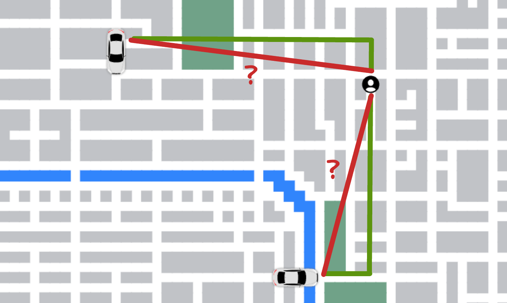

The next step in our simulation is matching drivers with customers. There are two main principles we want to adhere to. First, we want to match customers in a first-come-first-serve manner. Second, for a given customer, we want to find the driver that is closest to them.

How do we find the distance between a customer and the available drivers? Ideally, we would calculate the shortest path for all drivers. But here's a problem - a path-finding algorithm might be pretty time-consuming - if not for this map, then definitely for a larger one. And remember that our dispatcher can only match one driver at a time. Because the driver might constantly be _moving_, by the time we have calculated our perfectly accurate distance, the driver might be quite far away from its original distance, and our calculation will not be precise after all.

So here's what we can do. Let's approximate the distance using the Pythagorean theorem. This will only give us a rough approximation of the actual distance, but the calculation will be very quick.



Now onto the implementation. Whenever a customer becomes active and decides on the destination, they will send a match request to the `dispatcher`:

```js
g.dispatcher.send({
  from: "customer",
  data: {
    customerId: this.customerId,
    name: this.name,
    location: this.location,
  },
});
```

Similarly, whenever a driver becomes active, it reports its availability to the `dispatcher`:

```js
g.dispatcher.send({
  from: "driver",
  data: {
    driverId: this.driverId,
    name: this.name,
    location: this.location,
  },
});
```

Same as with the `getDestination` service, `dispatcher` is a child process that runs separately from our main event loop. When it receives customer updates, it pushes the requests onto `customerQueue`. The incoming driver updates from newly available drivers are stored in the `drivers` array.

```js
process.on('message', ({ from, data }: Message) => {
  if (from === 'customer') {
    const { customerId, name, location } = data as CustomerData;
    customerQueue.push({ customerId, name, location });
  } else if (from === 'driver') {
    const { driverId, name, location } = data as DriverData;
    drivers.push({ driverId, name, location });
  }
});
```

The main method of `dispatcher` keeps grabbing the oldest customer request from the queue. For the given request, we look at the available drivers and sort them based on their distance from the customer in descending order. We then pop off the last (closest) driver from the array and send an update to the main process.

```js
while (true) {
  // ...
  if (customerQueue.length && drivers.length) {
    const { customerId, location, name } = customerQueue.shift();

    drivers.sort((driverA, driverB) => {
      return (
        getStraightLineDistance(driverB.location, location) -
        getStraightLineDistance(driverA.location, location)
      );
    });

    const matchedDriver = drivers.pop();
    const { driverId } = matchedDriver;

    process.send({ customerId, driverId });
  }

  // ...
}
```

In the main process, we look up the target `Customer` instance with the `customerId` and update its state with the matched driver. Similarly, we update the target `Driver` with the matched customer.

```js
dispatcher.on(
  "message",
  ({ customerId, driverId }: { customerId: string, driverId: string }) => {
    customerInstances[customerId].handleDispatcherResult(driverId);
    driverInstances[driverId].handleDispatcherResult(customerId);
  }
);
```

Drivers and customers are now being matched. Of course, our method has limitations. We are always prioritizing the oldest customer request, potentially at the expense of other customers. Rather than matching the oldest one first, we could evaluate several requests at once and find a matching that minimizes the average distance across all of them. Also, we should set a limit on how far a driver is willing to travel to pick up a customer. But as a first stab at this problem, this is good enough!

```
2023-03-10 21:02:33 Matched William <> Alice | distance: 32
2023-03-10 21:02:34 Matched Frank <> Paul | distance: 28
2023-03-10 21:02:34 Matched Steven <> Andrew | distance: 32
```
