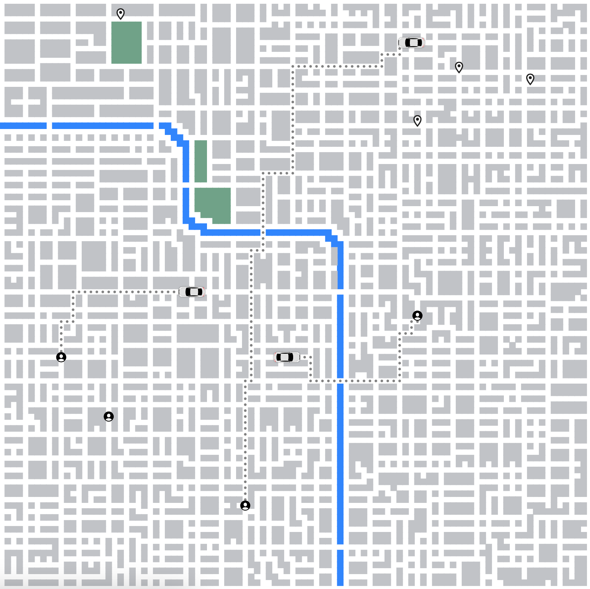

Now that a driver is matched with a customer, we need them to head to the customer to pick them up. Which path should they follow? The shortest one, of course.

Once the driver has been matched, they will send the request to the routePlanner.

```js
if (this.customerId && this.customerLocation && !this.path) {
  this.busy = true;
  g.routePlanner.send({
    driverId: this.driverId,
    startingPosition: this.location,
    destination: this.customerLocation,
  });
}
```

The `routePlanner` follows the now standard structure of a child process. It processes items from the queue, one at a time. Once it calculates the shortest path, it returns the result to the main process.

```js
const queue: Message[] = [];

process.on(
  "message",
  ({ driverId, startingPosition, destination }: Message) => {
    queue.push({ driverId, startingPosition, destination });
  }
);

const main = async () => {
  while (true) {
    if (queue.length) {
      const { driverId, startingPosition, destination } = queue.shift();
      let path = getShortestPath(startingPosition, destination);
      process.send({ driverId, path });
    }

    // ...
  }
};
```

To calculate the shortest path, we again use the breadth-first search traversal (BFS). The property of BFS is that once it has reached a node, it has done so using the shortest possible path (there might be multiple such paths). There are more optimal algorithms for finding the shortest path, such as Dijkstra or A\*, but we will keep things simple for now as we want to keep moving.

```js
export const getShortestPath = (
  startingPosition: CoordPair,
  destination: CoordPair,
  graph: Graph = getGraph()
): Path => {
  // ...

  const [col, row]: CoordPair = startingPosition;
  let queue: [Coord, Coord, CoordPair[]][] = [[row, col, [startingPosition]]];
  const seen = new Set([`${row}:${col}`]);

  while (queue.length) {
    const nextQueue = [];
    for (let i = 0; i < queue.length; i++) {
      const [row, col, currPath] = queue[i];

      if (row === destination[1] && col === destination[0]) {
        return currPath;
      }

      for (let j = 0; j < directions.length; j++) {
        const [dx, dy]: [number, number] = directions[j];

        const nextRow = row + dy;
        const nextCol = col + dx;

        if (isValid(nextRow, nextCol) && !seen.has(`${nextRow}:${nextCol}`)) {
          seen.add(`${nextRow}:${nextCol}`);
          nextQueue.push([nextRow, nextCol, [...currPath, [nextCol, nextRow]]]);
        }
      }
    }
    queue = nextQueue;
  }
};
```

Once we receive the shortest path in the main process, we update the relevant driver with the handler.

```js
routePlanner.on(
  "message",
  ({ driverId, path }: { driverId: string, path: Path }) => {
    driverInstances[driverId].handleRoutePlannerResult(path);
  }
);
```

After we update a driver record in the database, we are ready to draw the path on the map. We do that by rendering a `circle` element for every coordinate pair on the given driver's path.

```js
const pathElems = cars.map(({ path, pathIndex }) => {
  return path.slice(pathIndex).map((coordPair) => {
    const [x, y] = coordPair;
    return (
      <circle
        key={`${x}:${y}`}
        width={squareSize / 4}
        height={squareSize / 4}
        r={squareSize / 6}
        cx={x * squareSize + squareSize / 2}
        cy={y * squareSize + squareSize / 2}
        fill={"gray"}
        stroke={"gray"}
      />
    );
  });
});
```

Now that the drivers know where to go to pick up the customer, they need to drive there. We'll tackle that in the next post!

