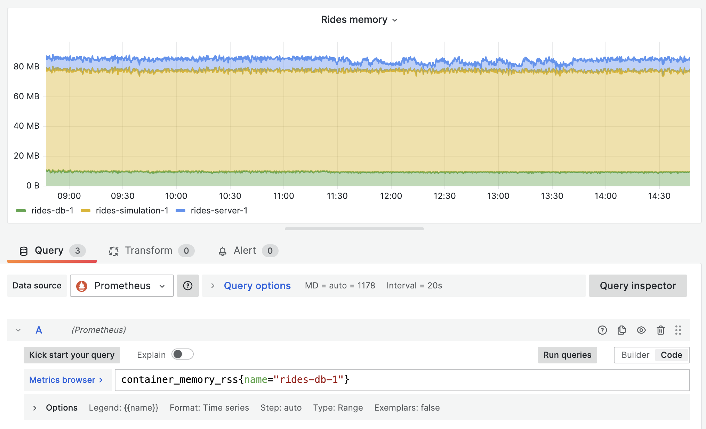
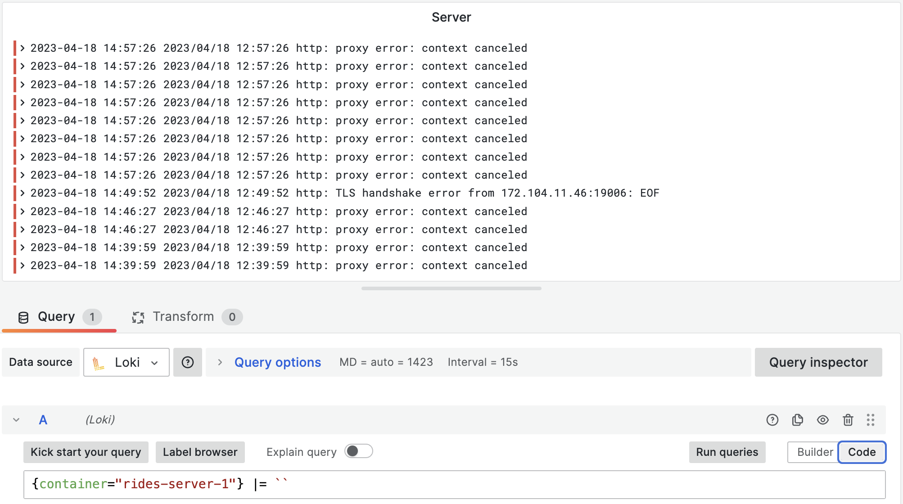
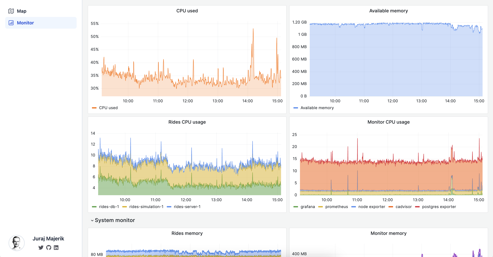

Now that our simulation is running, let's set up monitoring and logging to track the performance of our system.

Of course, one can always peek at the server without fancy tools. With Docker applications, we can use the `docker logs` command to view the logs of any container. To check for the memory or CPU consumption, we can simply use `htop`.

In a distributed system, however, this quickly becomes cumbersome. If the system as a whole is failing, we might potentially need to walk through every individual component to diagnose the issue.

So here's a better solution - let's use _Prometheus_ and _Grafana_ to implement monitoring and logging. This will provide us all the information we need at our fingertips.

The monitoring stack consists of the following components:

- **_Prometheus_** is the server that collects metrics from various sources and stores them such that they are available for querying. We will use three exporters: _node_exporter_, _cadvisor_ and _postgres_exporter_.
- **_node_exporter_** exposes system-level metrics, such as CPU and memory usage.
- **_cadvisor_** provides container-level metrics
- **_postgres_exporter_** exposes PostgreSQL metrics
- **_Grafana_** is the dashboard that fetches data from the _Prometheus_ server and displays it in a customizable UI.
- **_Promtail_** collects logs from various sources, and forwards them to the Loki server for storage.
- **_Loki_** efficiently stores the logs, indexes them for fast retrieval, and provides APIs for querying them from the _Grafana_ dashboard.

Each of the items listed above is its own Docker container. To isolate monitoring and logging from our main application stack, I've put all configuration files and the docker-compose files into the new `monitor` folder.

I recommend to have a look at the config files to get a better understanding of how the system is wired up. That said, these are some of the key points of the setup:

- _Prometheus_ scrapes metrics from the exporters. It needs to know their address (localhost + port). The scraping happens every couple of seconds (configurable). Prometheus then exposes the data via an API at `localhost:9090`.
- The _Prometheus_ exporters _Prometheus_ scrape the data from the log files stored in the system. Therefore the log files need to be mounted as their volumes (as read-only).
- Promtail allows us to add various metadata to logs, such as labels (see the pipeline*stages section of \_promtail* config file). This makes logs easy to query.
- Grafana exposes the dashboard at `localhost:3000`. Requests to `rides.jurajmajerik.com/grafana` are reverse-proxied to `localhost:3000`, returning the dashboard to the user.

Once set up, we can open up our Grafana dashboard, connect data sources (_Prometheus_ & Loki), and add visualization panels. For any panel, we use _queries_ to fetch data from the metrics server. For example, to fetch the memory consumption of our database container, we can use `container_memory_rss{name="rides-db-1"}`.

The process works similarly for logs. Having tagged our logs with the container name, we can query our logs based this parameter.

I recommend [this](https://www.youtube.com/watch?v=9TJx7QTrTyo) and [this](https://www.youtube.com/watch?v=h_GGd7HfKQ8) video as a primer on the subject. If you run into issues, check out the GitHub Issues page of _Grafana_, _Prometheus_, or other relevant component. Someone else has likely had a similar problem before you.

Setting up _Grafana_ & _Prometheus_ stack is quite involved, and it took me some time to get it to a working state. Don't be discouraged with the sheer amount of configuration. It just requires a bit of persistence, tackling all the "wiring" details individually. The comprehensive overview of your system's behavior is well worth the effort.

Finally, I integrated the monitoring dashboard in the app UI with an iframe.

