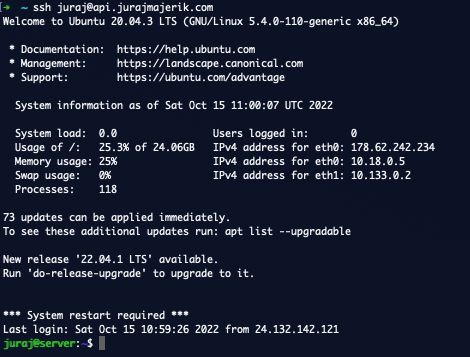

Right now, I have to enter the password every time I log in to the server. There is a better way to do this - authenticating via SSH keys. It's also arguably [more secure](https://security.stackexchange.com/questions/69407/why-is-using-an-ssh-key-more-secure-than-using-passwords).

This involves generating the SSH keys, and copying them over to the ```.ssh``` folder in the home directory. [This manual](https://www.digitalocean.com/community/tutorials/how-to-set-up-ssh-keys-2) describes the steps.

Once I'm finished, the authentication happens behind the scenes via SSH keys and I'm no longer being asked for the password.

