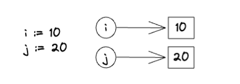

I'm a bit rusty with Go, so before I start coding, let's do a little refresher on pointers.

First, let's declare variables ```i``` and ```j``` and point them to values ```10``` and ```20``` respectively.


Next, let's declare a pointer variable ```p```. __A pointer variable stores the memory address of another variable__, in this case variable ```i```. Effectively, we set ```p``` to point to ```i```.


If we print "p", we get back the memory address.
```
fmt.Println(p)
> 0xc00001c030
```

To access the value that ```p``` is pointing to, we need to prefix ```*``` before ```p```.
```
fmt.Println(*p)
> 10
```

Next, we can update variable ```i``` through pointer ```p``` like so:


And verify with a print. We can see that ```i``` was updated.
```
  fmt.Println(p)
  > 0xc00001c030 // Memory address unchanged as we are still pointing to the same variable

  fmt.Println(i)
  > 15 // i was changed to 15

  fmt.Println(*p)
  > 15 // i was changed to 15, and p points to i
```

Finally, let's set ```p``` to point to a different variable, ```j```.


```
fmt.Println(i)
> 15 // i still points to 15

fmt.Println(p)
> 0xc00001c038 // p now has a new memory address

fmt.Println(*p)
> 20 // p now points to j, which points to 20
```
