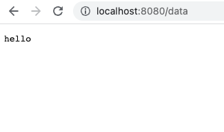

We aren't going to use any libraries at this point - just the native ```http``` module.

We are going to define a single *handler* function.

A handler function takes ```http.ResponseWriter``` and ```http.Request``` arguments. The second argument is passed as a pointer. I'm not sure why that is. One reason could be that it might be desirable to modify it, although I don't see why we would want to do that with the HTTP request object. A more likely explanation is that passing it by value would lead to copying the entire request object, which might be expensive. If I learn more about this, I will update this section.

```
func getData(w http.ResponseWriter, req *http.Request) {
	fmt.Fprintf(w, "hello\n")
}
```

We register our handler by calling ```http.HandleFunc()``` method, passing the path and the handler itself.

```
http.HandleFunc("/data", headers)
```

Finally, we define a port to listen to:
```
http.ListenAndServe(":8080", nil)
```

We start the server with ```go run main.go``` command.

We can now visit [http://localhost:8080](http://localhost:8080) in our browser. The base path will return a 404 - we haven't defined a handler for this path. When we add */data*, we get our response from the ```getData``` handler:



We can also make HTTP requests directly from the command line with [cURL](https://curl.se/):
```
$ curl http://localhost:8080
404 page not found
$ curl http://localhost:8080/data
hello
```
