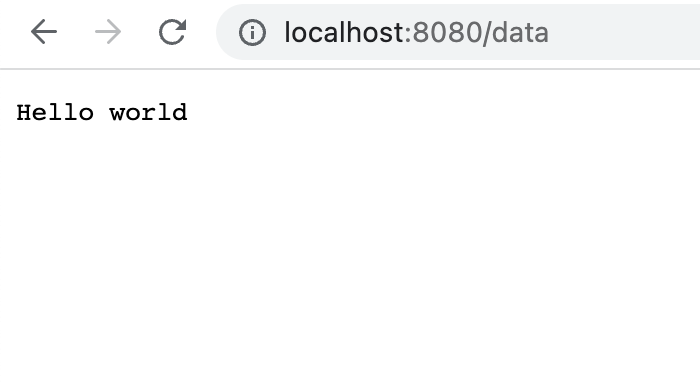

We're going to use the native ```http``` module to set up our first endpoint. This is done by creating a *handler* function.

A handler function takes ```http.ResponseWriter``` and ```http.Request``` arguments. The second argument is passed as a pointer. I don't know why that is. One reason could be that it allows to modify it, although I don't see why we would want to do that to an HTTP request object. A more likely explanation is that passing it by value would lead to copying the entire request object, which might be expensive. I'll update this section once I learn more.

More: ["Because it's a large struct. Copying it would be expensive. So it's a pointer to a struct, which is common in Go when structs are large."](https://stackoverflow.com/questions/31145564/why-must-the-http-request-argument-be-a-pointer)

We write the response from the handler using the ```fmt.Fprintf``` method. This method takes as its first parameter an instance of ```http.ResponseWriter```. The second argument is the response itself.

```go
func getData(w http.ResponseWriter, req *http.Request) {
  fmt.Fprintf(w, "Hello world\n")
}
```

We register our handler by calling ```http.HandleFunc()``` method, passing the path and the handler itself.

```go
http.HandleFunc("/data", getData)
```

Finally, we define a port to listen to:
```go
http.ListenAndServe(":8080", nil)
```

We start the server with ```go run main.go``` command.

We can now visit [http://localhost:8080](http://localhost:8080) in our browser. The base path will return a 404 - we haven't defined a handler for this path. When we add */data*, we get our response from the ```getData``` handler:



We can also make HTTP requests directly from the command line with [cURL](https://curl.se/):
```
$ curl http://localhost:8080
404 page not found
$ curl http://localhost:8080/data
Hello world
```

Here's the complete code of our server:
```go
package main

import (
  "fmt"
  "net/http"
)

func getData(w http.ResponseWriter, req *http.Request) {
  fmt.Fprintf(w, "Hello world\n")
}

func main() {
  http.HandleFunc("/data", getData)

  http.ListenAndServe(":8080", nil)
}
```
