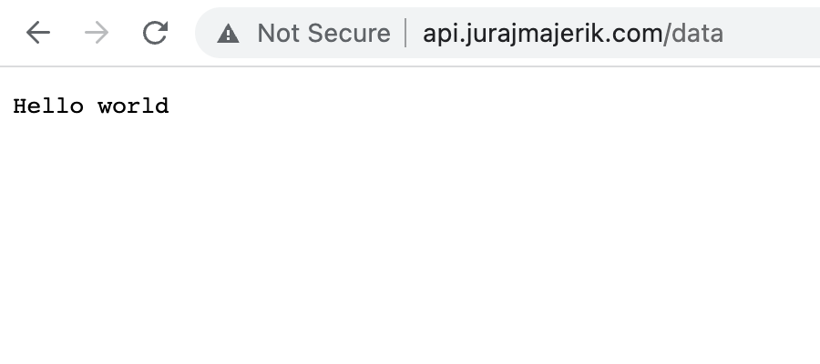

Let's copy our `server` folder to our server at `api.jurajmajerik.com`. We can do this with the `scp command`. Add the `-r` option to copy the entire directory recursively.

```
scp -r server juraj@api.jurajmajerik.com:~
```

When we log in to our server, we see the folder has been copied successfully.

```
juraj@server:~$ ls
server
```

There is an issue in our server code. It currently starts the server at `8080`, which is a local port. We can't connect to this port from the outside. So if we want to expose our server to the world - i.e., allow anyone to make HTTP requests to it, we need to start the server at port `80`.

So while still on our server, let's open the server code in an editor.

```
nano server/main.go
```

Change the port from `8080` to `80` and save the file.

```go
...
http.ListenAndServe(":80", nil)
...
```

Then `cd` to `server` and start it with `go run main.go`. The server, however, fails to start. That's because, for security reasons, ports below `1024` require root privileges. Therefore, we need to run the server with `sudo`.

`sudo` command has its own `$PATH`, which is defined in the sudo config. To add `go` to that path, do the following:

Open the sudo config file:

```
sudo visudo
```

Find the line starting with `Defaults secure_path`

Add the following to the end of the line:

```
:/usr/local/go/bin
```

Start the server:

```
sudo go run main.go
```

Now the world can make requests to our server!



One more thing. As soon as we log out, the program also stops. When we log out or disconnect from the remote server, the terminal session is terminated, along with any processes running within that session. To solve this, we need to run the command in the background. This is done by adding the `&` character after the command.

```
juraj@server:~/server$ sudo go run main.go &
[1] 2200302
```

We get back the process ID (PID): `2200302`. With a `ps -e` command, we can show all running processes in the system.

```
...
2200302 pts/1    00:00:00 sudo
2200303 pts/1    00:00:00 go
2200330 pts/1    00:00:00 main
...
```

For a reason I don't yet understand, our command seems to have started three processes: `sudo`, `go` and `main`. I'll update this section once I have the explanation for this.

Note: `sudo` runs a seprate process for reasons described in [this superuser question](https://superuser.com/questions/859701/why-does-sudo-fork-before-executing-the-process/859809#859809). `go run` compiles your code, executes the resulting binary, and then cleans up the results of compilation. In order to do the cleanup afterwards it needs to use a `fork()` model since `exec()` would not remember to do the cleanup (somewhat similar to the above).

We can stop a running process with a `kill <PID>`. To stop our server, we need to target the `main` process:

```
juraj@server:~/server$ sudo kill 2200330
signal: terminated
[1]+  Exit 1                  sudo go run main.go
```
