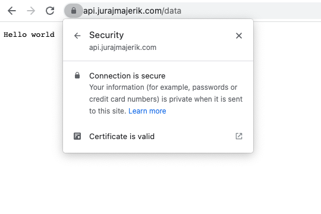

Let's enable HTTPS on our server. This will encrypt the data coming from and to our server.

First, we need to generate an SSL certificate. We can do this with [Let's Encrypt](https://letsencrypt.org/), a certification authority that issues SSL certificates for free. They offer a **Certbot** client for generating a certificate from the shell. The process is straightforward; just follow the instructions on [their website](https://certbot.eff.org/instructions?ws=other&os=ubuntufocal). Once we're done, the certificates are stored on our server:

```
Successfully received certificate.
Certificate is saved at: /etc/letsencrypt/live/api.jurajmajerik.com/fullchain.pem
Key is saved at:         /etc/letsencrypt/live/api.jurajmajerik.com/privkey.pem
This certificate expires on 2023-01-21.
These files will be updated when the certificate renews.
Certbot has set up a scheduled task to automatically renew this certificate in the background.
```

Let's now revisit our server code stored on our local machine. We need to switch to the `ListenAndServeTLS()` method. This method requires the port number (443 for HTTPS), the location of the certification file, and the private key file.

```go
http.ListenAndServeTLS(
  ":443",
  "/etc/letsencrypt/live/api.jurajmajerik.com/fullchain.pem",
  "/etc/letsencrypt/live/api.jurajmajerik.com/privkey.pem",
  nil,
)
```

Let's copy the file to our server.

```
scp -r server juraj@api.jurajmajerik.com:~
```

Start the server with `sudo go run main.go` and head to the browser. If we go to `https://api.jurajmajerik.com/data`, we can verify the server is now serving our data securely.


